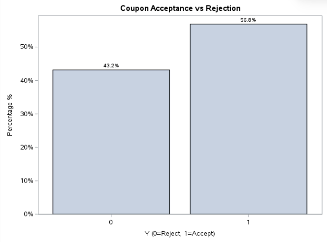
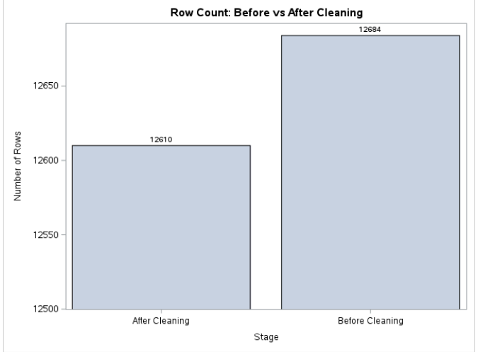
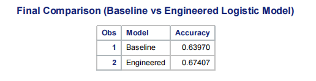

# 🚗 In-Vehicle Coupon Recommendation using SAS

A Data Science project developed using **SAS Studio** to analyze customer behavior and predict coupon acceptance using **Logistic Regression**, **Feature Engineering**, and **Exploratory Data Analysis (EDA)**.

---

# 📌 Project Overview

This project investigates customer responses to in-vehicle coupon recommendations. The objective is to predict whether a driver will **accept** or **reject** a coupon based on demographic information, driving context, weather conditions, destination, and behavioral patterns.

The project follows the complete Data Science lifecycle, from data exploration and preprocessing to feature engineering, predictive modeling, and evaluation.

---

# 🎯 Objectives

- Analyze customer behavior toward coupon recommendations.
- Identify the factors influencing coupon acceptance.
- Clean and prepare the dataset for modeling.
- Engineer meaningful behavioral features.
- Build and compare predictive classification models.
- Improve marketing decisions through data-driven insights.

---

# 📊 Dataset

**Dataset:** In-Vehicle Coupon Recommendation

**Source:** UCI Machine Learning Repository

- **12,684 observations**
- **26 original features**

### Target Variable

- **Y = 1** → Coupon Accepted
- **Y = 0** → Coupon Rejected

---

# 🛠 Tools & Technologies

- SAS Studio
- SAS Programming
- PROC SQL
- PROC FREQ
- PROC MEANS
- PROC SGPLOT
- PROC LOGISTIC

---

# 📂 Project Workflow

## 1. Data Exploration

- Dataset inspection
- Duplicate detection
- Variable type identification
- Target distribution analysis
- Descriptive statistics
- Correlation analysis
- Data visualization

---

## 2. Data Cleaning

Several preprocessing steps were applied to improve data quality:

- Removed 74 duplicate records
- Handled missing values
- Standardized categorical values
- Removed irrelevant variables
- Converted categorical age into numerical values

---

## 3. Feature Engineering

Seven behavioral features were created:

- Income Level
- Family Trip
- Free Destination Indicator
- Urgency Distance Trap
- Comfort Score
- Income Coupon Match
- Coupon Social Fit

Additional engineered features:

- Loyalty Match
- Good Timing
- Effort Too High

These engineered variables capture customer behavior beyond the original dataset.

---

## 4. Predictive Modeling

Two Logistic Regression models were developed.

### Baseline Model

Built using the original dataset features.

### Engineered Model

Built after introducing the engineered behavioral features.

The engineered model demonstrated better predictive performance and improved interpretation of customer behavior.

---

# 📈 Model Evaluation

The models were evaluated using:

- Accuracy
- ROC Curve
- AUC (Area Under the Curve)

The engineered model achieved better overall performance by incorporating behavioral insights.

---

# 📷 Results

## 📊 Coupon Acceptance vs Rejection

Comparison between accepted and rejected coupons.



---

## 🧹 Data Cleaning Process

Visualization of the preprocessing and cleaning steps applied before modeling.



---

## 🤖 Logistic Regression Prediction

Prediction results generated by the final Logistic Regression model.



---

# 💡 Key Findings

- Customer decisions depend strongly on context and behavior.
- Time, weather, destination, and previous habits significantly affect coupon acceptance.
- Behavioral feature engineering improved model performance.
- Logistic Regression provided interpretable predictions suitable for marketing applications.

---

# 🚀 Future Improvements

- Apply Decision Trees
- Random Forest
- XGBoost
- Gradient Boosting
- Hyperparameter Optimization
- Deploy the model as a web application

---

# 📁 Project Structure

```text
In-Vehicle-Coupon-Recommendation-SAS/
│
├── Coupon_Recommendation.sas
├── in-vehicle-coupon-recommendation(Data).csv
│
├── images/
│   ├── coupon_acceptance_vs_rejection.png
│   ├── data_cleaning.png
│   └── model_prediction.png
│
├── README.md
├── LICENSE
└── .gitignore
```
